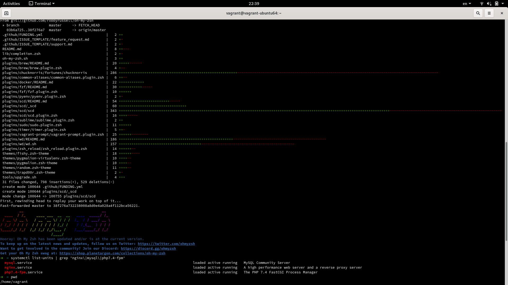
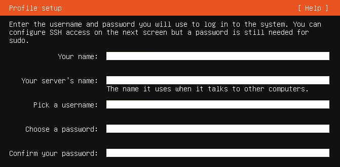

# vagrant-ubuntu64

Vagrant local development environment with PHP, NGiNX, MySQL (LEMP stack)

Download and install [Vagrant](https://www.vagrantup.com/downloads.html) and [VirtualBox](https://www.virtualbox.org/wiki/Downloads) (if you don’t have them), then install [VirtualBox Extension Pack](https://www.virtualbox.org/wiki/Downloads) to extend the functionality, read the [Docs](https://www.virtualbox.org/manual/ch01.html#intro-installing).

If you are using [Arch Linux](https://www.archlinux.org/) follow the wiki pages [Vagrant](https://wiki.archlinux.org/index.php/Vagrant) and [VirtualBox](https://wiki.archlinux.org/index.php/VirtualBox).

## Motivation

As a Vagrant Power-User I had fun installing and running multiple VMs simultaneously (with static IPv4 IPs on the 192.168.1.\* subnet and also with IPv6), I've done this hundreds of times with Puppet (with Master and Agent nodes), as well as Ansible. In bigging I mostly used pre-built Vagrant Boxes from [Vagrant Cloud](https://app.vagrantup.com/boxes/search) for convenience. It is often very useful and necessary (for administration/networking and programming purposes) to know what is going on "under the hood", because it gives you, way better insight into things that you can't see at first glance :wink: this is what motivated me to create my own Box.



## VirtualBox

**Name your box as (required):** `vagrant-ubuntu64`  
**Type:** `Linux`  
**Version:** `Ubuntu64`  
**Memory Size:** `2048MB`  
**Virtual disk type:** `VMDK (Pre-allocate Full Size)`  
**Fixed disk size:** `20 GB` (IMHO not less than 15GB)  
**Port forwarding:**
Name | Protocol | Host IP | Host Port | Guest IP | Guest port
--- | --- | --- | --- | --- | ---
SSH | TCP | blank | 2222 | blank | 22

## Ubuntu Server installation

Download the latest [Ubuntu Server](https://ubuntu.com/download/server) iso.  
Follow the installation process (all defaults), however, it is recommended to install OpenSSH Server. For name, server name, username and password, type: vagrant (in all input fields in following screen below):



## Ubuntu CLI

When the installation is complete, run the box and login with the vagrant user

```
$ sudo passwd root
$ sudo visudo -f /etc/sudoers.d/vagrant
```

Add the line `vagrant ALL=(ALL) NOPASSWD:ALL`

```
$ sudo apt update
$ sudo apt upgrade
$ sudo shutdown -r now
```

Login again

```
$ mkdir -p /home/vagrant/.ssh
$ chmod 0700 /home/vagrant/.ssh
$ wget --no-check-certificate https://raw.github.com/mitchellh/vagrant/master/keys/vagrant.pub -O /home/vagrant/.ssh/authorized_keys
$ chmod 0600 /home/vagrant/.ssh/authorized_keys
$ chown -R vagrant /home/vagrant/.ssh
$ sudo apt-get install -y openssh-server
$ sudo vim /etc/ssh/sshd_config
```

Uncomment the entire line `AuthorizedKeysFile`

```
$ sudo systemctl restart ssh
$ sudo apt-get install -y gcc build-essential linux-headers-$(uname -r)
```

On VirtualBox (top menu) click on "Devices" and then select "Insert Guest Additions CD Image", follow the installation process

```
$ sudo mount /dev/cdrom /mnt
$ cd /mnt
$ ls -la
$ sudo ./VBoxLinuxAdditions.run
$ sudo shutdown -r now
```

If the Guest Additions CD Image cannot be installed or if an error occurs

```
$ sudo add-apt-repository multiverse
$ sudo apt update
$ sudo apt install virtualbox-guest-utils virtualbox-guest-x11
$ sudo shutdown -r now
```

Then write a sparse file, with zeros in all blank spaces on the volume (make your disk as small as possible)

```
$ sudo dd if=/dev/zero of=/EMPTY bs=1M
$ sudo rm -f /EMPTY
$ cat /dev/null > ~/.bash_history && history -c && exit;
$ sudo shutdown now
```

On host (physical machine)

```
$ mkdir ~/projects/vagrantBoxes && cd ~/projects/vagrantBoxes
$ vagrant package --base vagrant-ubuntu64
$ vagrant box add vagrant-ubuntu64 package.box
$ git clone git@github.com:ncklinux/vagrant-ubuntu64.git
$ cd vagrant-ubuntu64
$ vagrant up
$ vagrant ssh
```

MySQL CLI (password `vagrant`)

```
$ mysql -u vagrant -p
```

Stop, destroy and remove the box

```
$ vagrant halt
$ vagrant destroy
$ vagrant box list
$ vagrant box remove vagrant-ubuntu64
```

## Support

The above project (Ubuntu Server LEMP environment) has been tested/hosted on [Arch Linux](https://www.archlinux.org/) but there are no differences between distributions (only the Vagrant/VirtualBox installation process differs e.g. Arch Linux provides Pacman, Ubuntu Apt etc), for reporting bugs, requesting features or better methods, it's best to open an [issue](https://github.com/ncklinux/vagrant-ubuntu64/issues/new). It's even better to accompany it with a Pull Request. ;)

[Watch this repo](https://github.com/ncklinux/vagrant-ubuntu64/subscription) :star: it and follow me on [GitHub](https://github.com/ncklinux) and [Twitter](https://twitter.com/ncklinux)

## License

GNU General Public License v3.0

## Powered by


## Alternative to Vagrant?

You could use [Docker!](https://github.com/ncklinux/docker-lemp)
